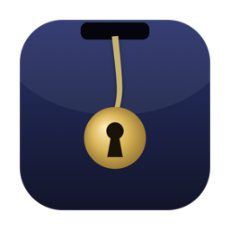
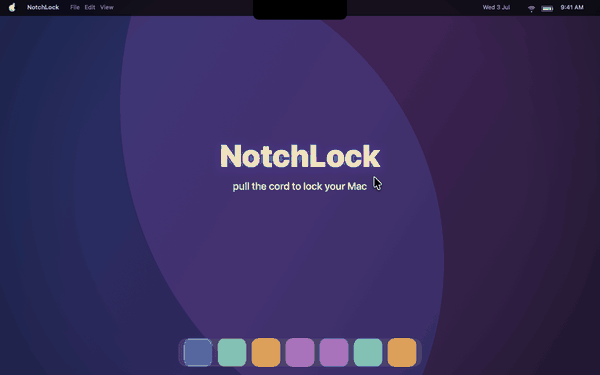
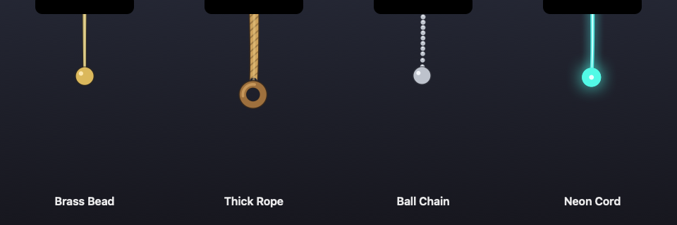

<div align="center">



# NotchLock

### Pull the cord. Lock your Mac. 🔒

**A brass pull‑string hangs from your MacBook notch — like the chain on an old
table lamp. Give it a tug and, a beat later, your Mac locks itself with a
satisfying click.**


[](https://github.com/A-VigneshRamamoorthy-Code/NotchLock/releases/latest)

<br/>



<sub>▶ <a href="assets/notchlock-demo.mp4"><b>Watch the HD video</b></a> · reveal on approach · right‑click to switch styles · pull the thick rope to lock</sub>

</div>

---

## ✨ The idea

Locking your Mac should feel as good as *chunk*‑ing off a lamp for the night.

Slide your cursor up to the notch and a little **pull‑cord drops out** on real
drop physics. Grab the bead, **pull it down** — the cord stretches toward your
hand and glows red once it's armed — then **let go**. It snaps back and swings
like a real lamp chain… and a couple of seconds later your **Mac locks**, with a
soft *click* as you grab and a chime as it locks.

No Dock icon. No menu‑bar icon. **0 % CPU** when it's just hanging there. And it
**comes back after a reboot**.

---

## 🎬 How to use it

<table>
<tr>
<td width="33%" valign="top">

### 1 · Approach
Move your cursor up to the **notch**. The cord **drops in line with your cursor**
(not just the centre) and hangs, swaying gently under gravity.

</td>
<td width="33%" valign="top">

### 2 · Pull
**Grab the bead** and drag it **down**. The cord stretches; past the threshold it
turns **red — armed**.

</td>
<td width="33%" valign="top">

### 3 · Lock
**Let go while it's pulled** and your **Mac locks instantly** with a sound. Change
your mind? Just bring the bead back up before releasing and nothing happens. 🌙

</td>
</tr>
</table>

> Prefer the keyboard‑free classic? Right‑click the notch for **Lock Screen Now**.

---

## 🎨 Choose your cord

**Right‑click under the notch** to pick a look — just like NotchPaw. Your choice is
remembered across launches, and every cord swings with its own **playful, springy**
personality.

<div align="center">

</div>

| Style | Vibe |
|-------|------|
| 🔔 **Brass Bead** | The classic — a thin brass cord with an amber pull‑bead. |
| 🪢 **Thick Rope** | A chunky twisted‑jute rope with a wooden ring handle. Hefty and tactile. |
| ⛓️ **Ball Chain** | A real metal lamp pull‑chain of little beads with an end knob. |
| 💡 **Neon Cord** | A glowing, extra‑bouncy cord with a luminous orb. |

The cord **peeks out the moment your cursor gets close to the notch**, sways gently
while it's out, and tucks away (back to **0 % CPU**) when you leave.

---

## 🧩 Features

|  |  |
|---|---|
| 🎨 **Four cord styles** | Brass bead, **thick rope**, ball chain, neon — switch anytime from the right‑click menu; your pick is remembered. |
| 🪝 **Lamp‑cord physics** | A pinned Verlet rope drops, hangs and swings under real gravity — grab, stretch, release, recoil, with a playful ambient sway. |
| 🔒 **Pull to lock** | Pull past the threshold and let go → NotchLock locks your screen **instantly** (same call as macOS *Lock Screen*). Bring the bead back up before releasing to cancel. |
| 🖐️ **Feels physical** | The cord drops in line with your cursor, shows an open‑hand on hover and a closed‑hand while you pull. |
| 🫥 **Truly invisible** | Agent app: **no Dock icon, no status‑bar icon**. A fully click‑through overlay — it never blocks a single click underneath. |
| 🪫 **0 % idle CPU** | The animation loop sleeps the instant the cord is tucked away. Nothing moving, nothing burning. |
| 🔁 **Survives reboot** | Registers a `RunAtLoad` LaunchAgent (self‑healing) so it's back after every restart or login. |
| 🖱️ **Zero permissions** | Uses global event monitors — no Accessibility or Screen‑Recording grants required. |
| 🎨 **Drawn in code** | Cord, bead, ring, icon — all CoreGraphics. No asset files, ~600 KB app. |
| 🛠️ **No Xcode** | Pure SwiftPM. Builds with the Command Line Tools and hand‑assembles the `.app`. |

---

## 📥 Install

1. Download **[`NotchLock.dmg`](https://github.com/A-VigneshRamamoorthy-Code/NotchLock/releases/latest/download/NotchLock.dmg)** from the [latest release](https://github.com/A-VigneshRamamoorthy-Code/NotchLock/releases/latest).
2. Drag **NotchLock** onto **Applications**.
3. Launch it. It's ad‑hoc signed (not notarized), so the first time
   **right‑click → Open** and confirm.
4. Slide to the notch, grab the cord, and pull. ✨

On first launch NotchLock sets itself to **start at login** — toggle that any time
from the right‑click menu.

> **Note on locking:** NotchLock locks using the same system routine as macOS
> *Lock Screen*. If that's ever unavailable it falls back to sleeping the display,
> which locks when *“Require password after sleep / screen saver begins”* is on in
> **System Settings → Lock Screen**.

---

## 🔧 Build from source

Needs only the **Command Line Tools** (no Xcode) on Apple silicon.

```bash
swift run notchlock-selftest      # headless physics/logic tests (35 checks)
./scripts/build_app.sh release    # → build/NotchLock.app
./scripts/make_dmg.sh             # → NotchLock.dmg (drag-to-install)
./scripts/install.sh              # copy to /Applications, launch, add login item
```

Preview the art & motion headlessly — no GUI, no Screen‑Recording permission:

```bash
swift run NotchLock --render  /tmp/pose      # hanging + armed poses
swift run NotchLock --contact /tmp/contact   # pull → release → swing contact sheet
swift run NotchLock --styles  /tmp/styles.png # all four cord looks, side by side
swift run NotchLock --demo    /tmp/demo      # the full product demo (mp4 + frames)
swift run NotchLock --appicon /tmp/icon.png  # the app icon
```

Handy env vars (all inert by default):

| Variable | Effect |
|----------|--------|
| `NOTCHLOCK_DRYRUN=1` | Log instead of actually locking the screen. |
| `NOTCHLOCK_DEBUG=1` | Log grab attempts and the bead position. |
| `NOTCHLOCK_SELFDRIVE=1` | Run an in‑process pull→lock integration test. |

---

## 🪄 Under the notch — how it works

Pure simulation/drawing is split from the AppKit shell so the “brains” are
unit‑testable headlessly:

```
Sources/
  NotchLockCore/           # PURE (no AppKit): testable + every pixel drawn here
    NotchGeometry.swift      #   notch rect + anchor from NSScreen data
    Spring.swift             #   damped spring (reveal / tuck)
    ChainStyle.swift         #   the four cord looks (brass/rope/ball-chain/neon) + tuning
    ChainEngine.swift        #   Verlet pull-cord: drop physics, grab/drag/release,
                             #     springy stretch, playful sway, fire-once lock threshold
    ChainRenderer.swift      #   per-look cord + handle + app icon (CoreGraphics)
  NotchLock/               # AppKit shell
    main.swift               #   entry (+ hidden --render/--contact/--demo/--appicon)
    AppDelegate.swift        #   monitors, drag state machine, menu, lock sequence
    OverlayWindow.swift      #   transparent, click-through NSPanel above the menu bar
    OverlayController.swift  #   maps the global cursor into the cord's space
    ChainView.swift          #   CADisplayLink loop (pauses at rest → 0% CPU)
    MouseTracker.swift       #   global + local NSEvent monitors (no permissions)
    LockController.swift     #   SACLockScreenImmediate (+ pmset fallback) + sounds
    LoginItem.swift          #   LaunchAgent install/repair (reboot survival)
    DemoRecorder.swift       #   the AVFoundation product-demo recorder
  notchlock-selftest/      # plain executable assertion harness (CLT has no XCTest)
scripts/                   # build_app.sh · make_dmg.sh · install.sh
```

The cord is a **rigid Verlet rope** pinned at the notch — so it hangs and swings
like a pendulum under gravity. Showing/hiding slides the pinned anchor above or
below the top edge (it never collapses), and the rope's **length is a spring**
that stretches to your hand while pulled and snaps back on release — that's the
lamp‑cord recoil. Grabs and pulls are read from **non‑consuming global `NSEvent`
monitors**, so the decorative overlay never eats your clicks.

The demo above isn't a screen capture — it's rendered by the **same core the live
app uses** (`--demo`), so what you see is exactly what runs.

---

## 📝 Notes

- Apple silicon, macOS 14+.
- Ad‑hoc signed (not notarized) → first‑launch right‑click → **Open**.
- Works on Macs **without** a notch too (falls back to a top‑centre region).

<div align="center"><sub>Made with 🤎 and CoreGraphics · pull the cord.</sub></div>
